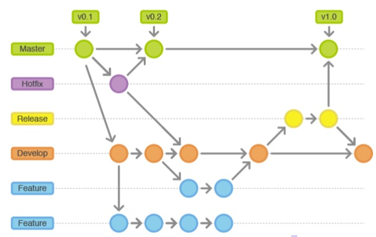

# Metodologia

Pré-requisitos: <a href="02-Especificação do Projeto.md"> Documentação de Especificação</a>

Descreva aqui a metodologia de trabalho do grupo para atacar o problema. Definições sobre os ambiente de trabalho utilizados pela  equipe para desenvolver o projeto. Abrange a relação de ambientes utilizados, a estrutura para gestão do código fonte, além da definição do processo e ferramenta através dos quais a equipe se organiza (Gestão de Times).

## Relação de Ambientes de Trabalho

Os artefatos do projeto são desenvolvidos a partir de diversas plataformas e a relação dos 
ambientes com seu respectivo propósito é apresentada na tabela que se segue.

|Ambiente                         |Plataforma e Link de Acesso                                                                                |
|---------------------------------|-----------------------------------------------------------------------------------------------------------|
|Repositório de código fonte      |[GitHub](https://github.com/ICEI-PUC-Minas-PMV-ADS/pmv-ads-2022-2-e2-proj-int-t6-ebatata)          |
|Documentos do projeto            |[GitHub](https://github.com/ICEI-PUC-Minas-PMV-ADS/pmv-ads-2022-2-e2-proj-int-t6-ebatata)          |
|Projeto de Interface             |[Figma](https://www.figma.com/file/jJy3yx68H78VreGmsXI07a/userflow-eBatata)                      |
|Wireframes                       |[Figma](https://www.figma.com/file/kLLoy6ks4U78nZB4u0Rzsm/eBatata-wireframes?node-id=0%3A1)                     |
|Gerenciamento do Projeto         |[GitHub](https://github.com/orgs/ICEI-PUC-Minas-PMV-ADS/projects/161/views/1)                                                            |

## Gestão de código fonte

Para  gestão  do  código  fonte  do  software  desenvolvido  pela  equipe,  o  grupo  utiliza  um 
processo  baseado  no  Git  Flow  abordado  por  Vietro  (2015),  mostrado  na  Figura  a  seguir. 
Desta  forma,  todas  as  manutenções  no  código  são  realizadas  em  branches  separados, 
identificados  como  Hotfix,  Release,  Develop  e  Feature.

## Gerenciamento de Projeto

### Divisão de Papéis

A equipe está organizada da seguinte maneira:

- **Scrum Master**: Eduardo Lobo

- **Product Owner**: João Lucas

- **Equipe de Desenvolvimento**: Leticia Isabela, Jessica Serqueira, Carlos, Eduardo Lobo, João Lucas

- **Equipe de Design**: Eduardo Lobo, João Lucas

### Processo
Recursos: esta lista mantém template de tarefas recorrentes com as configurações padronizadas que todos devem seguir. O objetivo é permitir a cópia destes templates para agilizar a criação de novos cartões.

Backlog: recebe as tarefas a serem trabalhadas e representa o Product Backlog. Todas as atividades identificadas no decorrer do projeto também devem ser incorporadas a esta lista.

- **To Do**: Esta lista representa o Sprint Backlog. Este é o Sprint atual que estamos trabalhando.

- **Doing**: Quando uma tarefa tiver sido iniciada, ela é movida para cá.

- **Check**: Checagem de Qualidade. Quando as tarefas são concluídas, eles são movidas para o “CQ”. 

- **Done**: Nesta lista são colocadas as tarefas que passaram pelos testes e controle de qualidade e estão prontos para ser entregues ao usuário. Não há mais edições ou revisões necessárias, ele está agendado e pronto para a ação.

### Ferramentas
As ferramentas empregadas no projeto são:

- **Editor de código**: Visual Studio Code
- **Ferramentas de comunicação**: Discord; WhatsApp; Teams
- **Ferramentas de desenho de tela (wireframing)**: Figma

O editor de código foi escolhido porque ele possui uma integração com o GitHub. As ferramentas de comunicação utilizadas possuem integração semelhante e por isso foram selecionadas. Por fim, para criar diagramas utilizamos o Figma por uma maior facilidade de uso.
